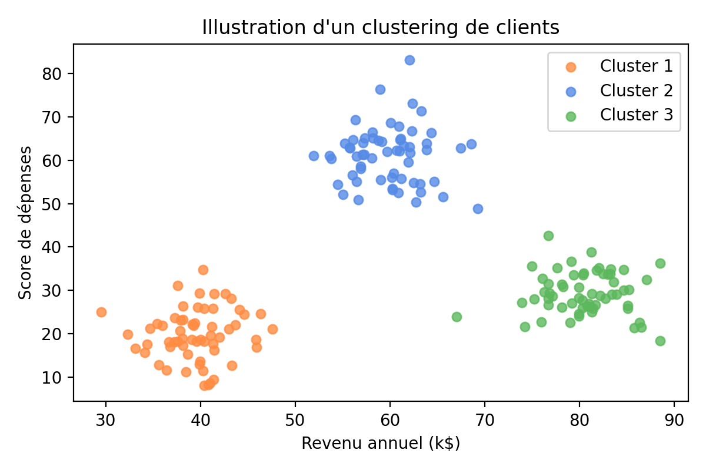
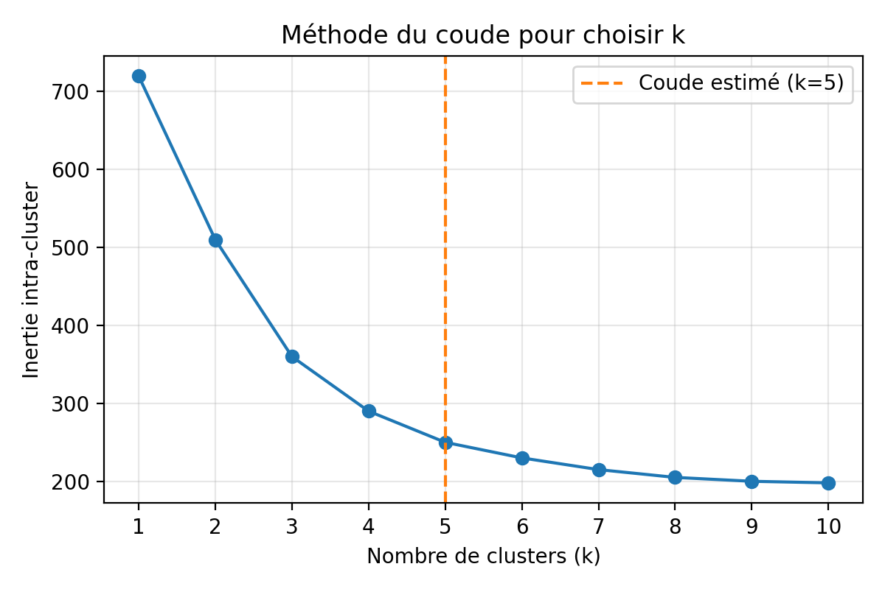

# TP2 – Clustering par K-Means

[⬅️ Retour au README](../../README.md)

## Introduction au clustering

Le clustering est une famille de méthodes d'apprentissage non supervisé qui regroupe automatiquement des observations similaires. L'objectif est de révéler des structures latentes dans les données afin de mieux comprendre des comportements, personnaliser des offres ou détecter des anomalies.

Dans un contexte marketing, segmenter un portefeuille clients permet par exemple d'adapter les campagnes, optimiser les recommandations produit et mesurer la valeur de chaque groupe.

> Figure 1 – Exemple de regroupement visuel de clients selon leur revenu annuel et leur score de dépenses.

## Algorithme K-Means

K-Means est l'un des algorithmes de clustering les plus utilisés pour créer *k* groupes homogènes. Il repose sur la minimisation de la distance entre chaque point et le centre de son cluster.

### Principales étapes

1. Initialiser *k* centroïdes (aléatoirement ou via une méthode avancée comme k-means++).
2. Assigner chaque observation au centroïde le plus proche (distance euclidienne par défaut).
3. Recalculer la position des centroïdes comme moyenne des points de leur cluster.
4. Répéter les étapes 2 et 3 jusqu’à convergence (changement négligeable des centroïdes ou nombre d’itérations atteint).

Le choix de *k* influence directement la qualité de la segmentation : trop faible, les groupes sont trop larges ; trop élevé, ils deviennent difficilement exploitables.

## Méthode du coude (Elbow method)

La méthode du coude aide à sélectionner un *k* pertinent. On entraîne K-Means pour différents *k*, puis on trace l'évolution de l'inertie (somme des distances au carré des points à leur centroïde).

Lorsque la courbe forme un coude, cela signifie que l'amélioration marginale de l'inertie devient faible : ce *k* constitue un bon compromis entre compacité des clusters et simplicité du modèle.

> Figure 2 – Illustration de la méthode du coude : le point *k* = 5 matérialise un bon équilibre.

## Contexte et objectifs

L'entreprise gérant un centre commercial souhaite mieux comprendre les profils de ses clients afin de personnaliser ses actions marketing. Vous allez mettre en œuvre l'algorithme de clustering K-Means pour segmenter les clients en fonction de leur revenu annuel et de leur score de dépenses.

## Jeu de données

Le jeu de données **Mall Customers** (CSV) contient des informations anonymisées : identifiant client, genre, âge, revenu annuel (k$) et score de dépenses (1-100). Les données seront importées depuis l'URL : <https://raw.githubusercontent.com/satishgunjal/datasets/master/Mall_Customers.csv>.

## Prérequis

- Python 3
- Bibliothèques : `pandas`, `numpy`, `matplotlib`, `scikit-learn`
- Travail dans un notebook Jupyter pour reproduire les cellules de code et documenter les résultats

## Déroulé du TP

1. Initialisez votre environnement en important `pandas`, `numpy`, `matplotlib.pyplot` (sous l'alias `plt`) et `KMeans` depuis `sklearn.cluster`.
2. Chargez le jeu de données dans un DataFrame pandas depuis l'URL fournie. Vérifiez les dimensions du tableau et affichez les premières lignes pour valider le chargement.
3. Répondez aux questions d'exploration : quelles sont les statistiques descriptives des variables numériques ? Y a-t-il des valeurs nulles ? Utilisez `df.describe()` et `df.info()`.
4. Renommez les colonnes `Annual Income (k$)` et `Spending Score (1-100)` en `AnnualIncome` et `SpendingScore` pour faciliter la manipulation. Contrôlez le résultat en affichant `df.columns`.
5. Proposez une première visualisation du couple (`AnnualIncome`, `SpendingScore`) à l'aide d'un nuage de points. Interprétez brièvement la répartition obtenue.
6. Construisez la matrice de caractéristiques `X` à partir des colonnes `AnnualIncome` et `SpendingScore` (utilisez `df.loc[:, ["AnnualIncome", "SpendingScore"]].values`) et vérifiez les premières lignes.
7. Déterminez un nombre de clusters pertinent en appliquant la méthode du coude : pour *k* allant de 1 à 10, entraînez un modèle `KMeans` (initialisation aléatoire, `random_state=42`) et stockez l'inertie associée. Tracez l'évolution de l'inertie en fonction de *k* et commentez le point de coude.
8. Entraînez un modèle `KMeans` avec *k* = 5 (`random_state=42`) sur la matrice `X`. Récupérez les étiquettes prédites pour chaque client.
9. Ajoutez ces étiquettes comme nouvelle colonne `Cluster` dans le DataFrame d'origine. Analysez les caractéristiques de chaque segment : effectifs par cluster, moyenne du revenu et du score de dépenses.
10. Visualisez les clusters sur le plan (`AnnualIncome`, `SpendingScore`) en attribuant une couleur par segment. Vérifiez la cohérence avec vos observations précédentes.
