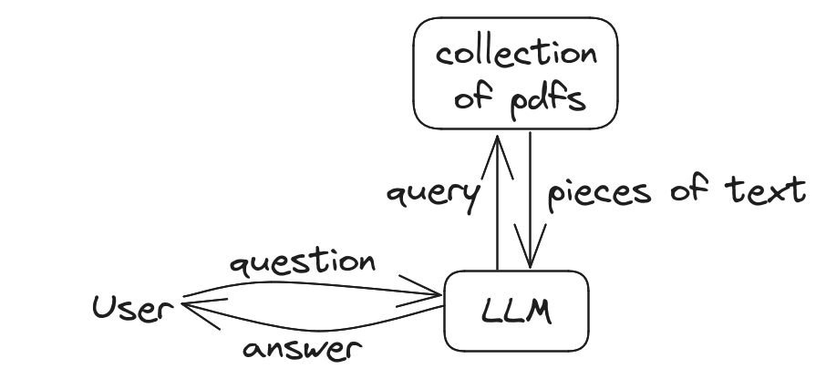
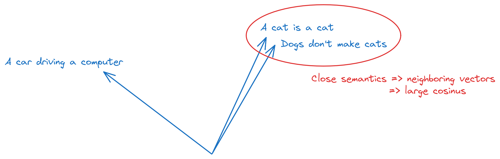
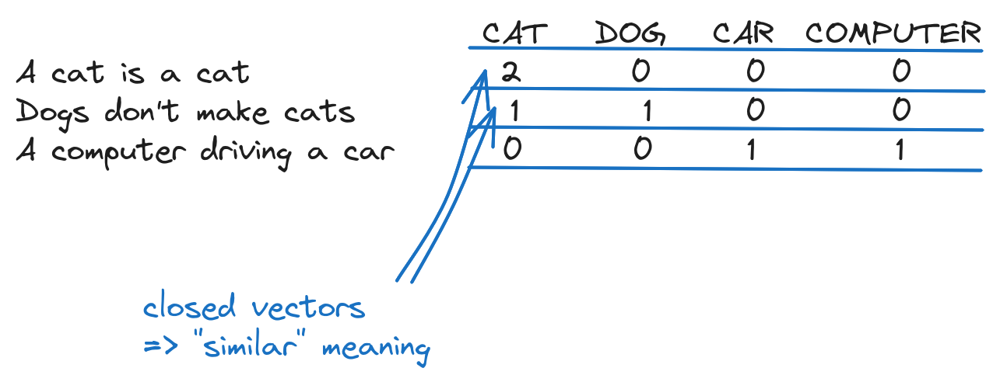
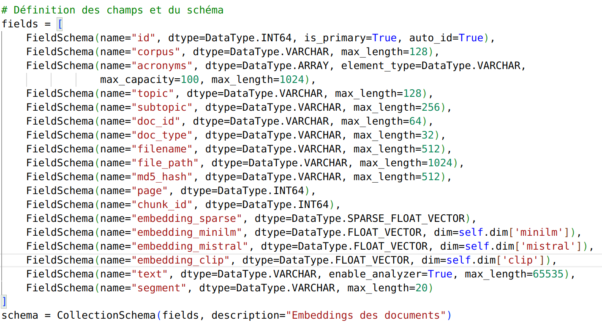

# TP3 — Systèmes RAG et bases vectorielles (≈ 2h)

[⬅️ Retour au sommaire](../LISEZMOI.md)

## Objectifs

- Comprendre comment représenter un texte sous forme de vecteur pour raisonner sur sa **sémantique**.
- Mettre en place une première pipeline de **Retrieval-Augmented Generation (RAG)** avec LangChain.
- Expérimenter différentes familles d'**embeddings** (bag-of-words, Transformers, API OpenAI) et mesurer leurs similarités.
- Construire un **vector store** FAISS/Hugging Face puis OpenAI pour interroger un corpus documentaire.

> 💡 **Conseil** — Ce TP prolonge le TP2 sur les sorties structurées. Nous allons maintenant structurer le *contexte* fourni au modèle à l'aide d'embeddings et de moteurs de recherche sémantique.



## Prérequis

- Python ≥ 3.10 et un environnement virtuel actif.
- Bibliothèques recommandées : `scikit-learn`, `numpy`, `sentence-transformers`, `langchain`, `langchain-community`, `langchain-mistralai`, `langchain-huggingface`, `langchain-openai`, `faiss-cpu`.
- Clés API valides pour Mistral AI et, si vous souhaitez tester les embeddings distants, OpenAI.
- Avoir consulté le dossier `images/Guyeux_2024.pdf` placé dans `IA générative/`.

---

## Étape 1 — Pourquoi encoder le texte ? (≈ 10 min)

Un embedding transforme un texte en vecteur numérique. Deux textes proches sémantiquement deviennent deux vecteurs proches dans l'espace vectoriel.



👉 **Exercice 1.1** — Listez trois applications concrètes (moteur de recherche, recommandation, détection de doublons, etc.) où la proximité sémantique est déterminante.

👉 **Exercice 1.2** — Ouvrez `img/rag2.png` et décrivez, en quelques phrases, le rôle de chaque composant d'une architecture RAG.

---

## Étape 2 — Bag of Words : première représentation (≈ 15 min)

Créez `tp3_bow.py` avec le code suivant :

```python
from sklearn.feature_extraction.text import CountVectorizer

corpus = [
    "Demonstration text, first document",
    "Demo text, and here's a second document.",
    "And finally, this is the third document."
]

vectorizer = CountVectorizer()
X = vectorizer.fit_transform(corpus)

print("Vocabulary :", vectorizer.get_feature_names_out())
print("BoW vector:\n", X.toarray())
```



👉 **Exercice 2.1** — Ajoutez un quatrième document contenant un synonyme d'un mot existant. Que se passe-t-il dans la matrice ?

👉 **Exercice 2.2** — Limites : notez deux faiblesses de cette approche pour capturer la sémantique.

---

## Étape 3 — Embeddings par Transformers (≈ 20 min)

Passons à des représentations contextuelles avec `sentence-transformers`.

```python
from sentence_transformers import SentenceTransformer

sentences = [
    "This is an example sentence.",
    "Each sentence is converted into a fixed-sized vector."
]

model = SentenceTransformer("sentence-transformers/all-MiniLM-L6-v2", device="cpu")
embeddings = model.encode(sentences)

for sentence, embedding in zip(sentences, embeddings):
    print(f"{sentence!r} -> {embedding[:3]}...")

print(f"Embedding size: {len(embeddings[0])}")
```

👉 **Exercice 3.1** — Faites varier le modèle (`all-MiniLM-L12-v2`, `all-distilroberta-v1`, etc.) et comparez la taille des vecteurs.

👉 **Exercice 3.2** — Pourquoi force-t-on `device="cpu"` ? Essayez sans cette option et observez l'erreur remontée sur votre machine.

> 🧠 **Note** — Les modèles multilingues (ex. `paraphrase-multilingual-MiniLM-L12-v2`) offrent un meilleur support du français.

---

## Étape 4 — Mesurer la similarité cosinus (≈ 10 min)

Ajoutez ce bloc dans `tp3_bow.py` ou créez `tp3_similarity.py` :

```python
import numpy as np

def cosine_similarity(A, B):
    dot_product = np.dot(A, B)
    norm_A = np.linalg.norm(A)
    norm_B = np.linalg.norm(B)
    return dot_product / (norm_A * norm_B)

print(cosine_similarity(embeddings[0], embeddings[1]))
```

👉 **Exercice 4.1** — Calculez la similarité entre deux phrases très différentes. Quel comportement observez-vous ?

👉 **Exercice 4.2** — Implémentez une fonction qui renvoie la phrase la plus proche d'une requête donnée parmi une liste.

---

## Étape 5 — Tester les embeddings OpenAI (≈ 15 min)

```python
from openai import OpenAI

client = OpenAI()

def embed(text, model="text-embedding-3-large", dimensions=3072):
    return client.embeddings.create(
        input=[text],
        model=model,
        dimensions=dimensions
    ).data[0].embedding

vector1 = embed("What is Mycobacterium kansasii ?")
vector2 = embed(
    "To sum up, we have presented a case of Mycobacterium kansasii monoarthritis..."
)

print(cosine_similarity(vector1, vector2))
```

👉 **Exercice 5.1** — Comparez le score de similarité avec celui obtenu via `sentence-transformers`.

👉 **Exercice 5.2** — Réduisez `dimensions` à 256. Quel impact sur la qualité (à tester empiriquement) ?

> ⚠️ **Attention** — L'utilisation des API OpenAI est payante. Fixez un quota dans votre tableau de bord.

---

## Étape 6 — Premiers pas en RAG (≈ 15 min)


Créez `tp3_rag_basique.py` :

```python
from langchain_mistralai.chat_models import ChatMistralAI

llm = ChatMistralAI(model_name="mistral-large-latest")

query = "What is Mycobacterium kansasii ?"
context = (
    "To sum up, we have presented a case of Mycobacterium kansasii monoarthritis..."
)

prompt = f"""You are an expert in the Mycobacterium field.\n"""
"""Answer the question using ONLY the context provided.\n\n"""
"""Question: {query}\n\nContext: {context}"""

response = llm.invoke(prompt)
print(response.content)
```

👉 **Exercice 6.1** — Modifiez la consigne pour forcer l'IA à répondre en français.

👉 **Exercice 6.2** — Ajoutez une étape de validation : si le contexte ne contient pas l'information, le modèle doit répondre « Je ne sais pas ».

---

## Étape 7 — Construire un vector store FAISS (≈ 25 min)

Nous allons indexer le PDF `images/Guyeux_2024.pdf`.

```python
import warnings
from textwrap import shorten, fill

from langchain_community.document_loaders import PyPDFLoader
from langchain_community.vectorstores import FAISS
from langchain_huggingface import HuggingFaceEmbeddings

warnings.simplefilter("ignore")

loader = PyPDFLoader("images/Guyeux_2024.pdf")
pages = loader.load_and_split()

embeddings = HuggingFaceEmbeddings(model_name="sentence-transformers/all-MiniLM-L6-v2")
faiss_index = FAISS.from_documents(pages, embeddings)

docs = faiss_index.similarity_search(
    "Is there a lineage 10 in M.tuberculosis?",
    k=2
)

for doc in docs:
    print(f"Page {doc.metadata['page']}: {fill(shorten(doc.page_content, 500), 80)}\n")
```

👉 **Exercice 7.1** — Changez la requête pour trouver la localisation géographique d'une lignée.

👉 **Exercice 7.2** — Ajoutez une étape RAG complète : formatez un prompt `Question + Contexte concaténé` et envoyez-le au LLM.



> 📷 **Astuce** — Comparez les fonctionnalités de Milvus à celles de FAISS (filtrage, multi-embeddings, gestion distribuée, etc.).

---

## Étape 8 — Utiliser les embeddings OpenAI dans FAISS (≈ 10 min)

```python
from langchain_openai import OpenAIEmbeddings

loader = PyPDFLoader("images/Guyeux_2024.pdf")
pages = loader.load_and_split()

faiss_index = FAISS.from_documents(pages, OpenAIEmbeddings())
docs = faiss_index.similarity_search("Is there a lineage 10 in M.tuberculosis?", k=2)

for doc in docs:
    print(doc.metadata, doc.page_content[:200], "...")
```

👉 **Exercice 8.1** — Mesurez le temps d'indexation avec les embeddings OpenAI vs HuggingFace.

👉 **Exercice 8.2** — Ajoutez un mécanisme de cache local pour éviter les appels répétés (suggestion : `langchain-core.cache`).

---

## Étape 9 — Splitting et nettoyage des textes (≈ 15 min)

```python
from langchain_text_splitters import RecursiveCharacterTextSplitter

text = """Vous pouvez partager un article en cliquant sur les icônes..."""

text_splitter = RecursiveCharacterTextSplitter(
    chunk_size=500,
    chunk_overlap=200,
    keep_separator=False,
    separators=["\n\n", "\n", ". "]
)

texts = text_splitter.create_documents([text])

for chunk in texts[:5]:
    print(chunk.page_content)
    print("=" * 20)
```

👉 **Exercice 9.1** — Testez différents couples `chunk_size` / `chunk_overlap`. Comment évolue la cohérence des réponses ?

👉 **Exercice 9.2** — Impliquez le splitter dans votre pipeline FAISS : re-splitez le PDF avant indexation.

---

## Étape 10 — Autres loaders et vector stores (≈ 10 min)

```python
from langchain_community.document_loaders import YoutubeLoader

loader = YoutubeLoader.from_youtube_url(
    "https://www.youtube.com/watch?v=YcIbZGTRMjI",
    language=["fr"],
    add_video_info=False
)

print(loader.load())
```

👉 **Exercice 10.1** — Identifiez d'autres loaders utiles pour vos données (Markdown, HTML, bases SQL...).

👉 **Exercice 10.2** — Comparez FAISS à d'autres vector stores (Chroma, Milvus...). Quels scénarios justifient un déploiement plus complexe ?

---

## Synthèse

1. **Embeddings** : vous avez manipulé plusieurs représentations vectorielles (BoW, Transformers, API).
2. **Similarité** : vous savez mesurer la proximité sémantique via le cosinus.
3. **RAG** : vous avez orchestré un pipeline allant du chargement de documents à la génération guidée.
4. **Industrialisation** : les notions de text splitting, loaders et vector stores ouvrent la voie à des applications robustes.


## Pour aller plus loin

- Évaluez vos résultats avec des métriques dédiées (ex. `RetrievalQAWithSourcesChain` + mesures de précision/rappel).
- Expérimentez Milvus ou Weaviate pour gérer plusieurs espaces d'embeddings et du filtrage métadonnées.
- Combinez ce TP avec le TP2 pour contraindre la forme finale des réponses générées.

Bon TP et bonnes explorations !
