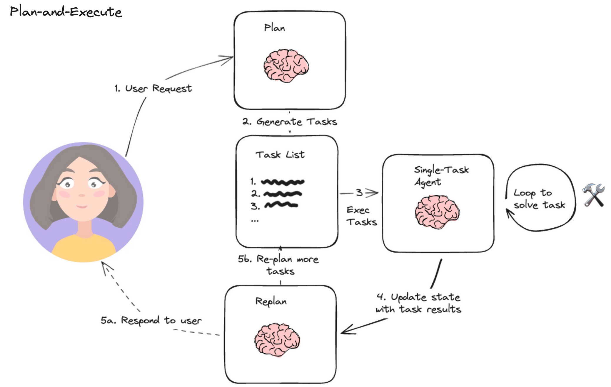
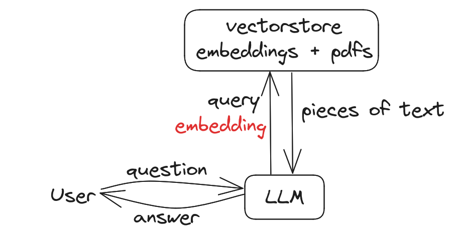

# TP4 — Orchestration d'agents avec LangChain (≈ 2h)

[⬅️ Retour au sommaire](../LISEZMOI.md)

## Objectifs

- Comprendre les principes d'un agent piloté par un LLM et son exécuteur.
- Installer et configurer des outils courants (Wikipedia, Tavily, arXiv, Python REPL...).
- Créer, enrichir et orchestrer différents agents LangChain autour de cas d'usage concrets.
- Concevoir vos propres outils et composer plusieurs agents spécialisés.

## Prérequis

- Python 3.10 ou supérieur.
- Avoir suivi les TP1 à TP3 (maîtrise basique de LangChain, prompts, sorties structurées).
- Connaissances de base sur les API et les variables d'environnement.

## Ressources utiles

- [Documentation LangChain – Agents](https://python.langchain.com/docs/modules/agents/)
- [LangSmith Hub](https://smith.langchain.com/hub) pour explorer des prompts d'agents prêts à l'emploi.
- [Tavily](https://www.tavily.com/) pour créer une clé d'API de recherche web.

---

## Étape 0 — Rappel : qu'est-ce qu'un agent ? (≈ 10 min)

Un **agent** est un système autonome propulsé par un modèle de langage qui reçoit des données en entrée et décide des actions à entreprendre en fonction de son objectif et des outils disponibles. Il combine :

- la **prise de décision** (le LLM planifie les actions) ;
- l'**exécution** (un ou plusieurs outils réalisent l'action demandée) ;
- la **boucle de rétroaction** (l'exécuteur d'agent transmet les résultats au LLM pour la suite du raisonnement).



👉 **Exercice 0.1** — En deux phrases, décrivez un cas d'usage professionnel où vous combineriez plusieurs agents spécialisés.

👉 **Exercice 0.2** — Identifiez un outil (API, script, base de connaissances) que vous souhaiteriez exposer à un agent LLM.

---

## Étape 1 — Préparer l'environnement (≈ 15 min)

1. Créez un environnement virtuel et installez les dépendances minimales :
   ```bash
   python -m venv tp4_agents
   source tp4_agents/bin/activate  # Sous Windows : tp4_agents\Scripts\activate
   pip install langchain langchain-community langchain-openai langchain-mistralai wikipedia langchain-tavily arxiv python-dotenv
   ```
2. Dans un fichier `.env`, stockez vos clés :
   ```env
   TAVILY_API_KEY="votre-cle"
   MISTRAL_API_KEY="..."     # optionnel si vous utilisez Mistral
   OPENAI_API_KEY="..."       # optionnel si vous utilisez OpenAI
   ```
3. Chargez les variables dans vos scripts via `dotenv` ou `os.environ`.

👉 **Exercice 1.1** — Vérifiez votre installation en important `langchain`, `langchain_community.tools` et `langchain_openai` dans un shell Python.

👉 **Exercice 1.2** *(optionnel)* — Ajoutez `pre-commit` pour automatiser le formatage/linting des scripts d'agents.

---

## Étape 2 — Premier outil : interroger Wikipedia (≈ 15 min)

Un agent simple peut se limiter à un outil, ici `WikipediaQueryRun`.

```python
#%pip install --upgrade --quiet wikipedia
from langchain.tools import WikipediaQueryRun
from langchain_community.utilities import WikipediaAPIWrapper

wikipedia = WikipediaQueryRun(api_wrapper=WikipediaAPIWrapper())
print(wikipedia.run("Alan Turing"))
```

👉 **Exercice 2.1** — Créez une fonction Python `resume_article(sujet: str) -> str` qui s'appuie sur l'outil Wikipedia et tronque la réponse à 500 caractères.

👉 **Exercice 2.2** — Quels sont les avantages et limites d'un agent *mono-outil* dans vos projets ? Notez-les dans un fichier `notes.md`.

---

## Étape 3 — Agent ReAct avec recherche Tavily (≈ 25 min)

La recherche web en direct illustre bien l'intérêt d'un agent ReAct (Reasoning + Acting).

```python
from langchain import hub
from langchain.agents import create_react_agent, AgentExecutor
from langchain_community.tools.tavily_search import TavilySearchResults
from langchain_mistralai.chat_models import ChatMistralAI

search = TavilySearchResults(max_results=2)
tools = [search]

llm = ChatMistralAI(model="mistral-large-latest", temperature=0)

prompt = hub.pull("amalnuaimi/react-mistral")
agent = create_react_agent(llm, tools, prompt)
agent_executor = AgentExecutor(agent=agent, tools=tools, verbose=True)

response = agent_executor.invoke({
    "input": "Dois-je prendre un parapluie, sachant que je me rends aujourd'hui et demain à Belfort ?",
    "chat_history": []
})
print(response["output"])
```

👉 **Exercice 3.1** — Ajoutez un second outil (`WikipediaQueryRun`) et observez l'impact sur le plan d'action de l'agent. Analysez le `intermediate_steps` retourné par l'`AgentExecutor`.

👉 **Exercice 3.2** — Modifiez le prompt système pour forcer l'agent à répondre en français formel et à citer ses sources.

👉 **Exercice 3.3** *(optionnel)* — Remplacez `ChatMistralAI` par `ChatOpenAI(model_name="gpt-4.1")` et comparez les traces.

---

## Étape 4 — Variante OpenAI & hub ReAct (≈ 15 min)

Pour comparer facilement deux fournisseurs de LLM :

```python
from langchain import hub
from langchain.agents import create_react_agent, AgentExecutor
from langchain_community.tools.tavily_search import TavilySearchResults
from langchain_openai import ChatOpenAI

search = TavilySearchResults(max_results=2)
tools = [search]

llm = ChatOpenAI(model_name="gpt-4.1")

prompt = hub.pull("hwchase17/react")
agent = create_react_agent(llm, tools, prompt)
agent_executor = AgentExecutor(agent=agent, tools=tools, verbose=True)

response = agent_executor.invoke({
    "input": "Dois-je prendre un parapluie, sachant que je me rends aujourd'hui et demain à Belfort ?"
})
print(response["output"])
```

👉 **Exercice 4.1** — Activez `return_intermediate_steps=True` dans l'exécuteur et inspectez les requêtes envoyées à Tavily.

👉 **Exercice 4.2** — Mesurez le coût d'inférence (`usage_metadata`) pour 3 requêtes différentes et construisez un tableau comparatif Mistral vs OpenAI.

---

## Étape 5 — Agents spécialisés sur la littérature scientifique (≈ 20 min)

Utilisez l'outil `arxiv` pour interroger des publications scientifiques.

```python
from langchain import hub
from langchain.agents import AgentExecutor, create_react_agent, load_tools
from langchain_mistralai.chat_models import ChatMistralAI

llm = ChatMistralAI(model="mistral-large-latest", temperature=0)
tools = load_tools(["arxiv"])

prompt = hub.pull("hwchase17/react")
agent = create_react_agent(llm, tools, prompt)
agent_executor = AgentExecutor(agent=agent, tools=tools, verbose=True)

agent_executor.invoke({"input": "Résume l'article 1605.08386 en français"})
```

👉 **Exercice 5.1** — Explorez `tools[0].name` et `tools[0].description` pour documenter l'outil dans votre readme d'équipe.

👉 **Exercice 5.2** — Créez un prompt personnalisé qui impose la structure suivante : *Résumé*, *Points clés*, *Applications potentielles*.

👉 **Exercice 5.3** *(optionnel)* — Récupérez le PDF source via l'API arXiv et stockez-le localement pour une utilisation ultérieure en RAG.

---

## Étape 6 — Agent développeur : Python REPL (≈ 20 min)

L'outil `PythonREPLTool` permet à l'agent d'exécuter du code Python pour résoudre des problèmes calculatoires.

```python
from langchain.agents import create_openai_functions_agent
from langchain_experimental.tools import PythonREPLTool
from langchain_openai import ChatOpenAI
from langchain import hub

tools = [PythonREPLTool()]

instructions = """You are an agent designed to write and execute python code to answer questions.
You have access to a python REPL, which you can use to execute python code.
If you get an error, debug your code and try again.
Only use the output of your code to answer the question. 
You might know the answer without running any code, but you should still run the code to get the answer.
If it does not seem like you can write code to answer the question, just return "I don't know" as the answer.
"""

base_prompt = hub.pull("langchain-ai/openai-functions-template")
prompt = base_prompt.partial(instructions=instructions)
agent = create_openai_functions_agent(ChatOpenAI(temperature=0), tools, prompt)

agent_executor = AgentExecutor(agent=agent, tools=tools, verbose=True)
agent_executor.invoke({"input": "Quel est le millième nombre de Fibonacci ?"})
```

👉 **Exercice 6.1** — Limitez le temps d'exécution (timeout) de l'exécuteur et observez le comportement de l'agent en cas de calcul long.

👉 **Exercice 6.2** — Ajoutez un garde-fou : si la sortie dépasse 200 caractères, tronquez la réponse avant de l'afficher à l'utilisateur.

---

## Étape 7 — Combiner plusieurs outils (≈ 20 min)

Les agents deviennent plus polyvalents lorsqu'ils orchestrent plusieurs actions.

```python
from langchain.agents import load_tools, create_react_agent
from langchain_openai import OpenAI
from langchain import hub
from langchain.agents import AgentExecutor

llm = OpenAI()
tools = load_tools(["llm-math", "wikipedia"], llm=llm)
prompt = hub.pull("hwchase17/react")

agent = create_react_agent(llm, tools, prompt)
agent_executor = AgentExecutor(
    agent=agent,
    tools=tools,
    handle_parsing_errors=True,
    verbose=True
)

agent_executor.invoke({"input": "Qu'est-ce que 25% de 300?"})
```

👉 **Exercice 7.1** — Ajoutez un outil personnalisé qui convertit les devises (en interrogeant une API ou une table statique) et obligez l'agent à l'utiliser via un message système.

👉 **Exercice 7.2** — Observez le champ `handle_parsing_errors` : désactivez-le volontairement pour constater l'erreur et rédigez un mémo expliquant quand l'activer.

---

## Étape 8 — Concevoir vos propres outils (≈ 25 min)

Vous pouvez exposer de simples fonctions Python sous forme d'outils LangChain.

```python
from langchain_core.tools import tool

@tool
def multiply(first_int: int, second_int: int) -> int:
    """Multiplie deux entiers."""
    return first_int * second_int

@tool
def add(first_int: int, second_int: int) -> int:
    "Ajoute deux entiers."
    return first_int + second_int

@tool
def exponentiate(base: int, exponent: int) -> int:
    "Calcule la puissance d'un entier donné."
    return base**exponent
```

```python
from langchain import hub
from langchain.agents import AgentExecutor, create_tool_calling_agent
from langchain_openai import ChatOpenAI

llm = ChatOpenAI(model_name="gpt-4.1")

tools = [multiply, add, exponentiate]
prompt = hub.pull("hwchase17/openai-tools-agent")
agent = create_tool_calling_agent(llm, tools, prompt)
agent_executor = AgentExecutor(agent=agent, tools=tools, verbose=True)

agent_executor.invoke({
    "input": "Porter 3 à la puissance 5 et multiplier le résultat par la somme de douze et de trois, puis élever le tout au carré."
})
```

👉 **Exercice 8.1** — Ajoutez la validation des types (conversion en `int`) dans vos outils et gérez les erreurs utilisateur.

👉 **Exercice 8.2** — Créez un outil `log_to_file` qui enregistre chaque opération dans un fichier `operations.log`.

👉 **Exercice 8.3** *(optionnel)* — Définissez un `StructuredTool` pour exposer un schéma JSON précis aux agents.

---

## Étape 9 — Vers l'assemblage multi-agents (≈ 20 min)

Lorsque les besoins deviennent complexes, il est pertinent d'orchestrer plusieurs agents spécialisés (recherche, calcul, synthèse...).

1. Définissez un agent `chercheur` spécialisé en recherche documentaire (Tavily + arXiv).
2. Créez un agent `analyste` qui résume et compare les informations (Python REPL + outils mathématiques).
3. Utilisez un contrôleur (script Python ou LangGraph) pour orchestrer les appels successifs.



👉 **Exercice 9.1** — Dessinez un diagramme séquentiel illustrant l'orchestration entre deux agents et un exécuteur final.

👉 **Exercice 9.2** — Implémentez un script minimal qui enchaîne deux `AgentExecutor` et compare les réponses (temps, coût, qualité).

👉 **Exercice 9.3** *(optionnel)* — Explorez [LangGraph](https://python.langchain.com/docs/langgraph) pour modéliser ce flot de contrôle.

---

## Pour aller plus loin

- Expérimentez l'intégration d'un **RAG** avec un agent (vector store + outils de recherche personnalisés).
- Déployez vos agents dans un environnement serveur (FastAPI, Streamlit) et mesurez les performances.
- Étudiez les mécanismes de **sécurité** (guardrails, filtrage des prompts) pour des déploiements en production.

Bonne exploration !
