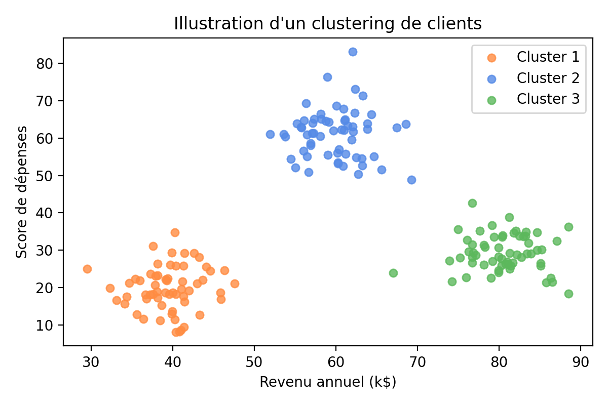
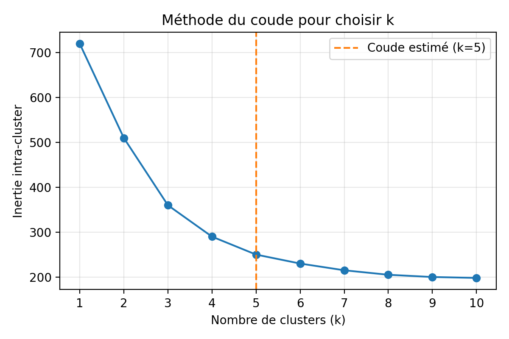

# TP2 - K-Means Clustering

[Back to contents](../../LISEZMOI.md)

## Introduction to clustering

Clustering is a family of unsupervised learning methods that automatically groups similar observations. The goal is to reveal latent structures in data in order to better understand behaviors, personalize offers, or detect anomalies.

In a marketing context, segmenting a customer portfolio helps adapt campaigns, optimize product recommendations, and measure the value of each group.

> Figure 1 - Example of visual grouping of customers by annual income and spending score.

## K-Means algorithm

K-Means is one of the most widely used clustering algorithms to create *k* homogeneous groups. It relies on minimizing the distance between each point and the center of its cluster.

### Main steps

1. Initialize *k* centroids (randomly or via an advanced method such as k-means++).
2. Assign each observation to the nearest centroid (Euclidean distance by default).
3. Recompute the centroids as the mean of the points in their cluster.
4. Repeat steps 2 and 3 until convergence (negligible change in centroids or max iterations reached).

The choice of *k* directly impacts segmentation quality: too small and clusters are too broad; too large and they become hard to exploit.

## Elbow method

The elbow method helps choose a relevant *k*. Train K-Means for different *k* values, then plot the inertia (sum of squared distances from points to their centroid).

When the curve forms an elbow, the marginal improvement in inertia becomes small: this *k* is a good tradeoff between compactness and model simplicity.

> Figure 2 - Illustration of the elbow method: the point *k* = 5 indicates a good balance.

## Context and objectives

The company operating a shopping mall wants to better understand customer profiles to personalize marketing actions. You will implement K-Means clustering to segment customers based on their annual income and spending score.

## Dataset

The **Mall Customers** dataset (CSV) contains anonymized information: customer ID, gender, age, annual income (k$), and spending score (1-100). Data will be imported from the URL: <https://raw.githubusercontent.com/satishgunjal/datasets/master/Mall_Customers.csv>.

## Prerequisites

- Python 3
- Libraries: `pandas`, `numpy`, `matplotlib`, `scikit-learn`
- Work in a Jupyter notebook to reproduce code cells and document results

## Lab steps

1. Initialize your environment by importing `pandas`, `numpy`, `matplotlib.pyplot` (as `plt`), and `KMeans` from `sklearn.cluster`.
2. Load the dataset into a pandas DataFrame from the provided URL. Check the table dimensions and display the first rows to confirm loading.
3. Answer exploration questions: what are the descriptive statistics of numeric variables? Are there missing values? Use `df.describe()` and `df.info()`.
4. Rename the columns `Annual Income (k$)` and `Spending Score (1-100)` to `AnnualIncome` and `SpendingScore` to simplify manipulation. Verify by printing `df.columns`.
5. Produce a first visualization of (`AnnualIncome`, `SpendingScore`) with a scatter plot. Briefly interpret the distribution.
6. Build the feature matrix `X` from the `AnnualIncome` and `SpendingScore` columns (use `df.loc[:, ["AnnualIncome", "SpendingScore"]].values`) and check the first rows.
7. Determine a relevant number of clusters using the elbow method: for *k* from 1 to 10, train a `KMeans` model (random initialization, `random_state=42`) and store the inertia. Plot inertia vs *k* and comment on the elbow point.
8. Train a `KMeans` model with *k* = 5 (`random_state=42`) on `X`. Retrieve the predicted labels for each customer.
9. Add these labels as a new `Cluster` column in the original DataFrame. Analyze each segment: counts per cluster, mean income, and mean spending score.
10. Visualize clusters on the (`AnnualIncome`, `SpendingScore`) plane by assigning a color per segment. Check consistency with your earlier observations.
